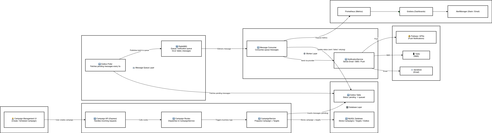

# Bulk Messaging Service

A production-grade microservice for managing large-scale marketing campaigns with Email, SMS, and Push notifications. Implements the Outbox pattern for reliable message delivery with automatic retries.

---

## Overview

- **Multi-Channel Support**: Email (SendGrid), SMS (Twilio), Push (Firebase/APNs)
- **Reliable Delivery**: Outbox pattern ensures zero message loss
- **Batch Processing**: Handle thousands of recipients efficiently
- **Automatic Retries**: Failed messages retry automatically (max 3 attempts, 5-min delay)
- **Idempotency**: SHA256-based keys prevent duplicate sends
- **Real-time Tracking**: Monitor campaign progress (pending/sent/failed)

---

## Architecture

```
┌──────────────────────────────────────────────────────────────────────────────┐
│                      BULK MESSAGING PLATFORM ARCHITECTURE                    │
└──────────────────────────────────────────────────────────────────────────────┘

┌──────────────────────────────────────────────────────────────────────────────┐
│                            APPLICATION LAYER                                 │
├──────────────────────────────────────────────────────────────────────────────┤
│                                                                              │
│   ┌──────────────┐      ┌──────────────┐      ┌──────────────────────┐       │
│   │ Campaign API │      │   Outbox     │      │   Consumer Workers   │       │
│   │  (Express)   │      │   Poller     │      │      (x3 instances)  │       │
│   │  Port: 3001  │      │  (Every 5s)  │      │                      │       │
│   └──────┬───────┘      └──────┬───────┘      └──────┬───────────────┘       │
│          │                     │                       │                     │
└──────────┼─────────────────────┼───────────────────────┼─────────────────────┘
           │                     │                       │
           ▼                     ▼                       ▼
┌──────────────────────────────────────────────────────────────────────────────┐
│                            BUSINESS LOGIC LAYER                              │
├──────────────────────────────────────────────────────────────────────────────┤
│                                                                              │
│   ┌──────────────────┐   ┌───────────────────┐   ┌────────────────────┐      │
│   │ CampaignService  │   │OutboxPollerService│   │NotificationService │      │
│   │                  │   │                   │   │                    │      │
│   │ • Create         │   │ • Poll Pending    │   │ • Send Email       │      │
│   │ • Prepare        │   │ • Poll Retrying   │   │ • Send SMS         │      │
│   │ • Track Progress │   │ • Publish to MQ   │   │ • Send Push        │      │
│   └────────┬─────────┘   └─────────┬─────────┘   └─────────┬──────────┘      │
│            │                       │                       │                 │
└────────────┼───────────────────────┼───────────────────────┼──────────────── ┘
             │                       │                       │
             ▼                       ▼                       ▼
┌──────────────────────────────────────────────────────────────────────────────┐
│                          DATA PERSISTENCE LAYER                              │
├──────────────────────────────────────────────────────────────────────────────┤
│                                                                              │
│  ┌────────────────────────────────────────────────────────────────────────┐  │
│  │                    MySQL Database                                      │  │
│  ├────────────────────────────────────────────────────────────────────────┤  │
│  │                                                                        │  │
│  │  campaigns         campaign_targets          outbox (Outbox Pattern)   │  │
│  │  ──────────        ────────────────          ──────────────────────    │  │
│  │  • id              • id                      • id                      │  │
│  │  • name            • campaign_id             • campaign_id             │  │
│  │  • kind            • user_ref                • user_ref                │  │
│  │  • status          • kind                    • kind                    │  │
│  │  • scheduled_at    • timezone                • payload                 │  │
│  │                    • metadata (JSON)         • idempotency_key         │  │
│  │                                              • status                  │  │
│  │                                              • attempts                │  │
│  │                                              • provider_msg_id         │  │
│  │                                              • last_error              │  │
│  │                                                                        │  │
│  └────────────────────────────────────────────────────────────────────────┘  │
│                                                                              │
└──────────────────────────────────────────────────────────────────────────────┘
                                      │
                                      ▼
┌─────────────────────────────────────────────────────────────────────────────┐
│                          MESSAGE QUEUE & CACHE LAYER                        │
├─────────────────────────────────────────────────────────────────────────────┤
│                                                                             │
│  ┌────────────────────────────────┐    ┌───────────────────────────────┐    │
│  │  RabbitMQ                      │    │  Redis                        │    │
│  ├────────────────────────────────┤    ├───────────────────────────────┤    │
│  │                                │    │                               │    │
│  │  notification.queue            │    │  • Campaign stats caching     │    │
│  │  ──────────────────            │    │  • Rate limiting              │    │
│  │  • outboxId                    │    │  • Deduplication checks       │    │
│  │  • idempotencyKey              │    │  • Session management         │    │
│  │  • campaignId                  │    │                               │    │
│  │  • userRef                     │    │                               │    │
│  │  • kind (email/sms/push)       │    │                               │    │
│  │                                │    │                               │    │
│  │  failed_messages (DLQ)         │    │                               │    │
│  │  • Permanent failures          │    │                               │    │
│  │                                │    │                               │    │
│  └────────────────────────────────┘    └───────────────────────────────┘    │
│                                                                             │
└─────────────────────────────────────────────────────────────────────────────┘
                                      │
                                      ▼
┌────────────────────────────────────────────────────────────────────────────┐
│                        EXTERNAL SERVICE PROVIDERS                          │
├────────────────────────────────────────────────────────────────────────────┤
│                                                                            │
│   ┌─────────────────┐   ┌─────────────────┐   ┌──────────────────────┐     │
│   │   SendGrid      │   │     Twilio      │   │  Firebase / APNs     │     │
│   │   (Email API)   │   │    (SMS API)    │   │ (Push Notifications) │     │
│   └─────────────────┘   └─────────────────┘   └──────────────────────┘     │
│                                                                            │
└────────────────────────────────────────────────────────────────────────────┘
                                      │
                                      ▼
┌────────────────────────────────────────────────────────────────────────────┐
│                    MONITORING & OBSERVABILITY STACK                        │
├────────────────────────────────────────────────────────────────────────────┤
│                                                                            │
│  METRICS                    LOGGING                    TRACING             │
│  ───────                    ───────                    ───────             │
│                                                                            │
│  ┌────────────────┐     ┌──────────────────┐     ┌──────────────────┐      │
│  │  Prometheus    │     │   ELK / Loki     │     │  Jaeger / Zipkin │      │
│  │                │     │                  │     │                  │      │
│  ├────────────────┤     ├──────────────────┤     ├──────────────────┤      │
│  │                │     │                  │     │                  │      │
│  │ • Messages/s   │     │ • App logs       │     │ • End-to-end     │      │
│  │ • Failed rate  │     │ • Error traces   │     │   tracing        │      │
│  │ • Queue depth  │     │ • Audit trail    │     │ • Latency        │      │
│  │ • Latency      │     │ • Campaign logs  │     │ • Dependencies   │      │
│  │ • DB conns     │     │ • Retry attempts │     │ • Bottlenecks    │      │
│  │ • CPU/Memory   │     │                  │     │                  │      │
│  └────────────────┘     └──────────────────┘     └──────────────────┘      │
│         │                        │                        │                │
│         └────────────────────────┴────────────────────────┘                │
│                                  │                                         │
│                                  ▼                                         │
│                     ┌─────────────────────────┐                            │
│                     │  Grafana                │                            │
│                     │  Unified Dashboards     │                            │
│                     └─────────────────────────┘                            │
│                                  │                                         │
│                                  ▼                                         │
│                     ┌─────────────────────────┐                            │
│                     │  AlertManager           │                            │
│                     │  (Slack/Email           │                            │
│                     └─────────────────────────┘                            │
│                                                                            │
│  HEALTH CHECKS                                                             │
│  ──────────────                                                            │
│  • /health   • /metrics   • /ready   • /live                               │
│                                                                            │
└────────────────────────────────────────────────────────────────────────────┘
```

---

## Configuration

Create `.env` file in `apps/bulk-messaging/`:

```env
# Database
DB_HOST=localhost
DB_PORT=3306
DB_USERNAME=root
DB_PASSWORD=password
DB_NAME=central_hub

# RabbitMQ
RABBITMQ_HOST=127.0.0.1
RABBITMQ_PORT=5672
RABBITMQ_USER=user
RABBITMQ_PASSWORD=password

# Redis
REDIS_HOST=127.0.0.1
REDIS_PORT=6379

# Email (SendGrid)
EMAIL_PROVIDER=sendgrid
EMAIL_API_KEY=SG.xxxxxxxxxxxxxxx
EMAIL_FROM=noreply@example.com

# SMS (Twilio)
SMS_PROVIDER=twilio
SMS_ACCOUNT_SID=ACxxxxxxxxxxxxxxx
SMS_AUTH_TOKEN=xxxxxxxxxxxxxxx
SMS_SENDER_ID=+1234567890

# Application
NODE_ENV=production
EXPRESS_APP_PORT=3001
```

---

## Database Schema

**campaigns**
- `id`, `name`, `kind` (email/sms/push), `status`, `scheduled_at`

**campaign_targets**
- `id`, `campaign_id`, `user_ref`, `kind`, `timezone`, `metadata` (JSON)

**outbox** (Outbox Pattern)
- `id`, `campaign_id`, `user_ref`, `kind`, `payload`, `idempotency_key`
- `status` (pending/queued/sent/failed/retrying), `attempts`, `provider_msg_id`

---

## Running the Application

```bash
# Build
npm run build

# Terminal 1: Start Outbox Poller
npm start

# Terminal 2: Start Consumer Workers
npm run run:consumer

# Seed test data (optional)
npm run seed
```

### Outbox Pattern Flow

```
1. Campaign Preparation
   → Create Campaign + Targets in DB
   → Batch process (1000/batch) with template rendering
   → Insert into outbox (status: pending)

2. Outbox Poller (every 5s)
   → SELECT ... FOR UPDATE SKIP LOCKED
   → Update status to "queued"
   → Publish to RabbitMQ

3. Consumer
   → Receive message from RabbitMQ
   → Validate idempotency
   → Send via provider (SendGrid/Twilio)
   → Mark as "sent" or "retrying" (on failure)

4. Retry Logic
   → Retry after 5 minutes (max 3 attempts)
   → Mark as "failed" after max attempts
```

---

## Key Commands

| Command | Description |
|---------|-------------|
| `npm run build` | Compile TypeScript |
| `npm start` | Start outbox poller |
| `npm run run:consumer` | Start message consumer |
| `npm run seed` | Generate test campaigns |

---

## Monitoring

**Key Metrics:**
- Outbox queue length: `SELECT COUNT(*) FROM outbox WHERE status='pending'`
- Failed rate: `SELECT COUNT(*) FROM outbox WHERE status='failed'`
- Consumer throughput: Messages/minute

**Alerts:**
- Queue depth > 10K for > 5 minutes
- Failed rate > 5% in last hour
- No messages sent in 15 minutes (during active campaign)

---